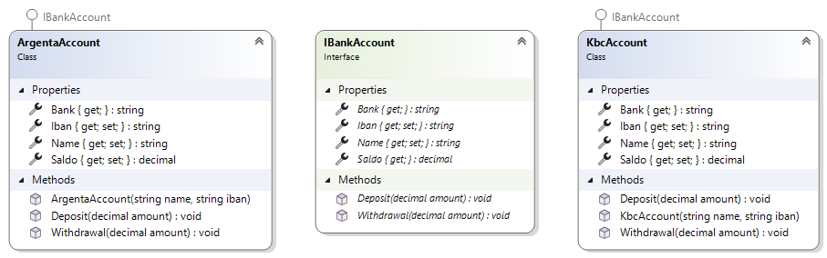
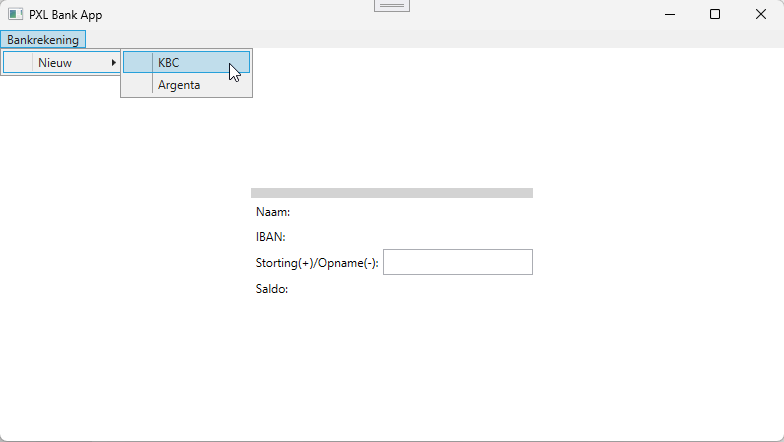
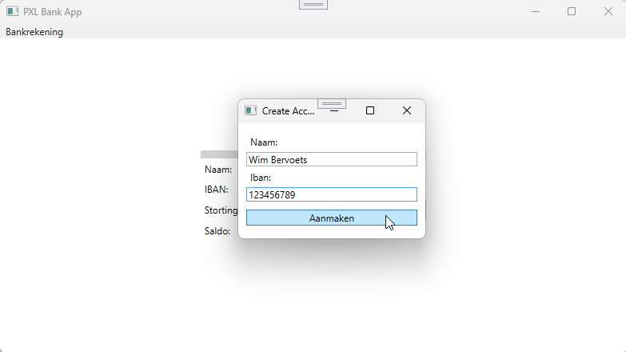
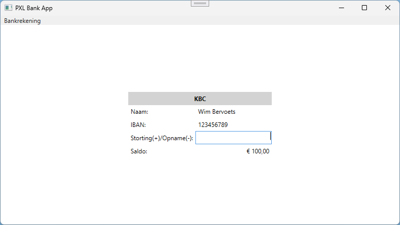
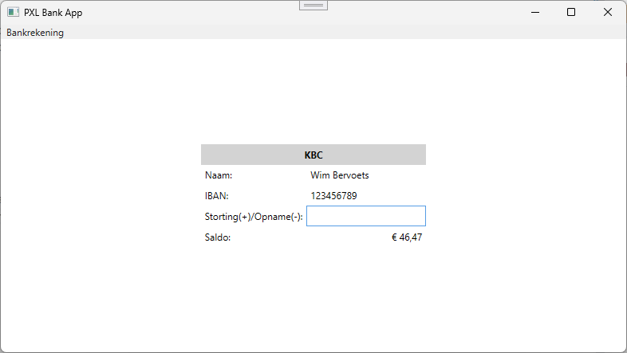

# Interfaces 2 - BankAccount

## IBankAccount
- Implementeer onderstaande diagram. Gebruik de *Models*-folder om de classes in aan te maken

- Zorg ervoor dat het saldo van een nieuwe KBC-rekening altijd € 100 is
- Zorg ervoor dat het saldo van een nieuwe Argenta-rekening altijd € 50 is
- Zorg ervoor dat bij elke opname van een KBC-rekening er ook 1% van het bedrag als kost wordt aangerekend (en dus van het saldo afgetrokken wordt)

## Vereisten
1. De gebruiker kan een nieuwe rekening openen door in het menu zijn bank te selecteren 
	

2. In het popup-venter (CreateAccountWindow) kan hij zijn naam en IBAN nummer ingeven 
    

3. Nadat de gebruiker op de knop aanmaken heeft geklikt wordt de nieuwe bankrekening aangemaakt en verschijnt de rekeninginformatie op het scherm
    

4. De gebruiker kan nu geld storten (deposit) en geld opnemen (withdrawal) door een bedrag in te geven en op de enter-toets te drukken
    
  
5. Na elke transactie wordt het nieuwe saldo weergegeven
    

> [!CAUTION]
> - Het saldo kan nooit kleiner zijn dan 0! Maak hiervoor een class *AccountException* die de standaard *Exception* class implementeert 

## Extra
- Hou een lijst van transacties bij per account en toon deze in een ListBox
- Bekijk welke functionaliteit eventueel verplaatst kan worden naar een base-class *BankAccount*